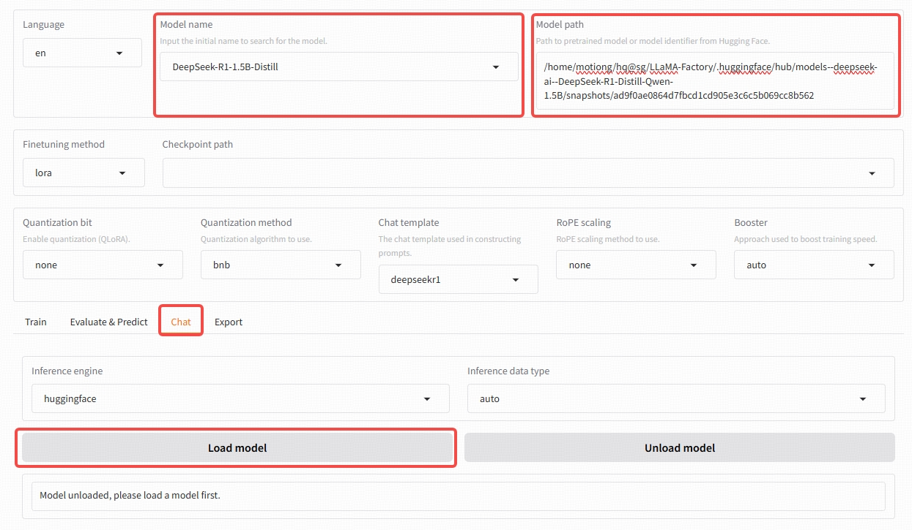
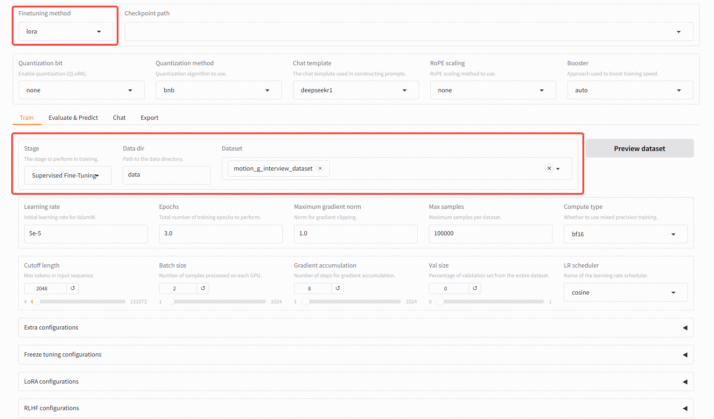
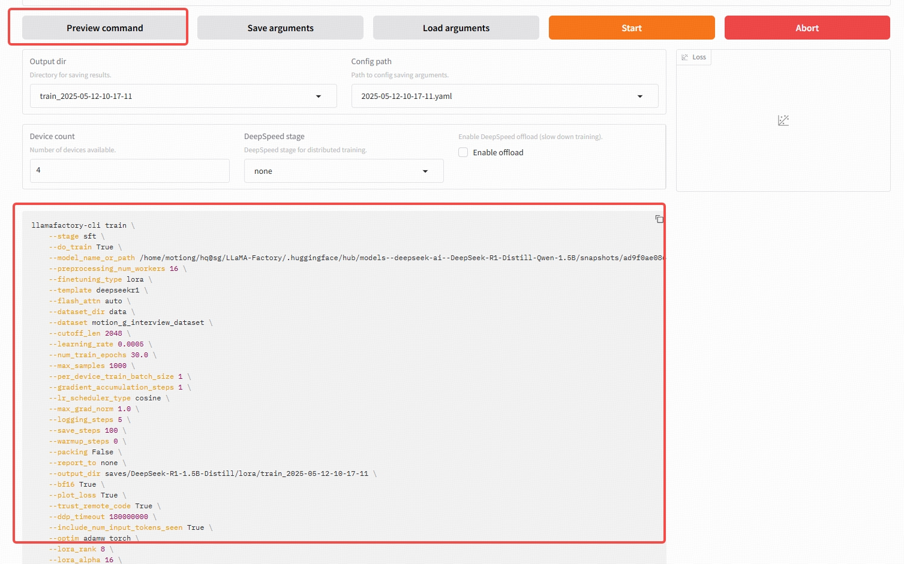

# Prepare your base model
### Set Saving path for Base Models

```bash
mkdir -p ~/hq@sg/LLaMA-Factory/.huggingface
export HF_HOME=~/hq@sg/LLaMA-Factory/.huggingface
```
> `echo $HF_HOME`  to check 

/home/motiong/hq@sg/LLaMA-Factory/.huggingface
### Install Huggingface_hub

```bash
pip install -U huggingface_hub
```

### Download Your base model
```bash
huggingface-cli download --resume-download deepseek-ai/DeepSeek-R1-Distill-Qwen-1.5B
```
```bash
huggingface-cli download --resume-download Qwen/Qwen2-0.5B
```
> The `--resume-download` parameter allows you to continue downloading from where it stopped if the download process was interrupted, rather than starting over from the beginning. 

### load the base model from the web cli

- choose the base model
- copy the snapshots hash path from the path you save the downloaded model
```
/home/motiong/hq@sg/LLaMA-Factory/.huggingface/hub/models--deepseek-ai--DeepSeek-R1-Distill-Qwen-1.5B/snapshots/ad9f0ae0864d7fbcd1cd905e3c6c5b069cc8b562
```
- switch to chat, and click load model to test if the model is loaded successfully



# Prepare dataset

- Prepare dataset based on [Dataset supported format guide](../data/README.md)
- Add dataset file `/home/motiong/hq@sg/LLaMA-Factory/data/motion_g_interview_dataset.json`
- Modify  `data/dataset_info.json` to ensure your dataset can be found.
    ```
    {
    "motion_g_interview_dataset": {
        "file_name": "motion_g_interview_dataset.json"
    },
        ...
    }
    ```
# Start to train
```
pip install deepspeed

```
- Choose your dataset, training method, parameters and so on

- Priview commond and run it on the server back service (recomended) or just click the start button.


```
CUDA_VISIBLE_DEVICES=0 llamafactory-cli train \
    --stage sft \
    --do_train True \
    --model_name_or_path /home/motiong/hq@sg/LLaMA-Factory/.huggingface/hub/models--deepseek-ai--DeepSeek-R1-Distill-Qwen-1.5B/snapshots/ad9f0ae0864d7fbcd1cd905e3c6c5b069cc8b562 \
    --preprocessing_num_workers 4 \
    --finetuning_type lora \
    --template deepseekr1 \
    --flash_attn disabled \
    --dataset_dir data \
    --dataset motion_g_interview_dataset \
    --cutoff_len 512 \
    --learning_rate 0.0005 \
    --num_train_epochs 30.0 \
    --max_samples 100 \
    --per_device_train_batch_size 1 \
    --gradient_accumulation_steps 2 \
    --lr_scheduler_type cosine \
    --max_grad_norm 1.0 \
    --logging_steps 5 \
    --save_steps 100 \
    --warmup_steps 0 \
    --packing False \
    --report_to none \
    --output_dir saves/DeepSeek-R1-1.5B-Distill/lora/train_2025-05-12-10-17-11 \
    --fp16 True \
    --plot_loss True \
    --trust_remote_code True \
    --ddp_timeout 180000000 \
    --include_num_input_tokens_seen True \
    --optim adamw_torch \
    --lora_rank 4 \
    --lora_alpha 8 \
    --lora_dropout 0 \
    --lora_target all \
    --val_size 0.1 \
    --eval_strategy steps \
    --eval_steps 100 \
    --gradient_checkpointing True \
    --per_device_eval_batch_size 1 \
    --deepspeed cache/ds_z3_offload_config.json
```

```
FORCE_TORCHRUN=1 CUDA_VISIBLE_DEVICES=2 llamafactory-cli train \
    --stage sft \
    --do_train True \
    --model_name_or_path /home/motiong/hq@sg/LLaMA-Factory/.huggingface/hub/models--Qwen--Qwen2-0.5B/snapshots/91d2aff3f957f99e4c74c962f2f408dcc88a18d8 \
    --preprocessing_num_workers 4\
    --finetuning_type lora \
    --template default \
    --flash_attn auto \
    --dataset_dir data \
    --dataset interview-qgen-alpaca-20250516-101021 \
    --cutoff_len 512 \
    --learning_rate 5e-05 \
    --num_train_epochs 30 \
    --max_samples 1000 \
    --per_device_train_batch_size 1 \
    --gradient_accumulation_steps 4 \
    --lr_scheduler_type cosine \
    --max_grad_norm 1.0 \
    --logging_steps 5 \
    --save_steps 100 \
    --warmup_steps 0 \
    --packing False \
    --report_to none \
    --output_dir saves/Qwen2-0.5B/lora/train_2025-05-18-16-01-01 \
    --fp16 True \
    --plot_loss True \
    --trust_remote_code True \
    --ddp_timeout 180000000 \
    --include_num_input_tokens_seen True \
    --optim adamw_torch \
    --lora_rank 8 \
    --lora_alpha 16 \
    --lora_dropout 0 \
    --lora_target all \
    --val_size 0.1 \
    --eval_strategy steps \
    --eval_steps 100 \
    --per_device_eval_batch_size 1 
```

# Merge and serve your sft model
